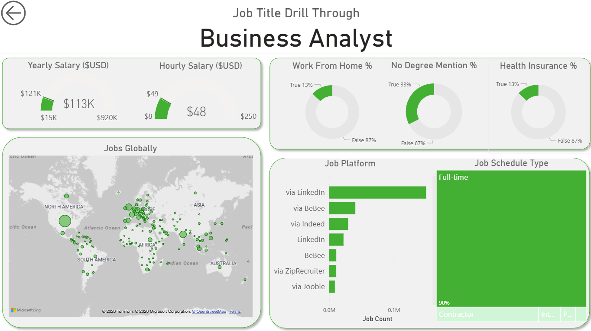

# 📊 Data Jobs Dashboard (Project 1)

## 📖 Introduction
This project is a comprehensive **Data Jobs Dashboard** designed to help job seekers explore the data science job market. Using real-world data from 2024 postings, I built this tool to visualize salaries, job counts, and location trends. 

This project was built following the *Data Analytics* course by [Luke Barousse](https://lukeb.co), focusing on the foundational aspects of Power BI: **ETL (Extract, Transform, Load)**, **Visual Design**, and **Error Checking**.

---

## 🔎 Page 1: Market Overview
The Executive Summary page provides a high-level view of the job market, allowing users to spot trends immediately.

### 🎥 Live Demo (Page 1)

### 📸 Static View (Page 1)

### Key Features (Page 1)
* **KPI Cards:** Instant view of total job postings (29K+) and median salaries ($95K).
* **Trending Analysis:** A line chart tracking job posting volume over time.
* **Salary Breakdown:** Scatter plot comparing Hourly vs. Median Yearly salaries to identify outliers.

---

## 🔎 Page 2: Drill-Through Detail
Users can right-click any job title (e.g., "Business Analyst") on the main page to "Drill Through" to this focused detail view.

### 🎥 Live Demo (Page 2)

### 📸 Static View (Page 2)

### Key Features (Page 2)
* **Geospatial Map:** Visualizes global hiring hotspots for the selected role.
* **Employment Trends:** Donut charts showing percentages for **Work From Home** availability and **Degree Requirements**.
* **Platform Analysis:** Bar chart identifying the top platforms (LinkedIn, Indeed) for finding these specific roles.

---

## 🛠️ Skills & Technologies Applied
* **Power BI Desktop:** Used for dashboard layout, bookmarking, and interactivity.
* **Power Query:** Performed data cleaning and transformation.
* **DAX (Data Analysis Expressions):** Wrote core measures for aggregated analysis.
* **Data Modeling:** Connected job postings with location data using a Star Schema.

## 🛡️ Data Validation & Error Checking
To ensure the dashboard provided accurate insights, I implemented several error-checking steps during the ETL process:
* **Handling Blanks:** Filtered out job postings with null salaries to prevent skewed average calculations.
* **Data Type Enforcement:** Verified that all salary columns were strictly numeric and date columns were valid.
* **Outlier Detection:** Reviewed salary ranges to identify and exclude erroneous outliers (e.g., hourly wages listed as yearly salaries).

## 🚀 How to Use
1.  Download the `.pbix` file from this repository.
2.  Open in **Power BI Desktop**.
3.  Select a Job Title from the dropdown slicer on Page 1.
4.  Click the **"Drill Through"** button (or right-click a bar chart item) to view the deep-dive details on Page 2.